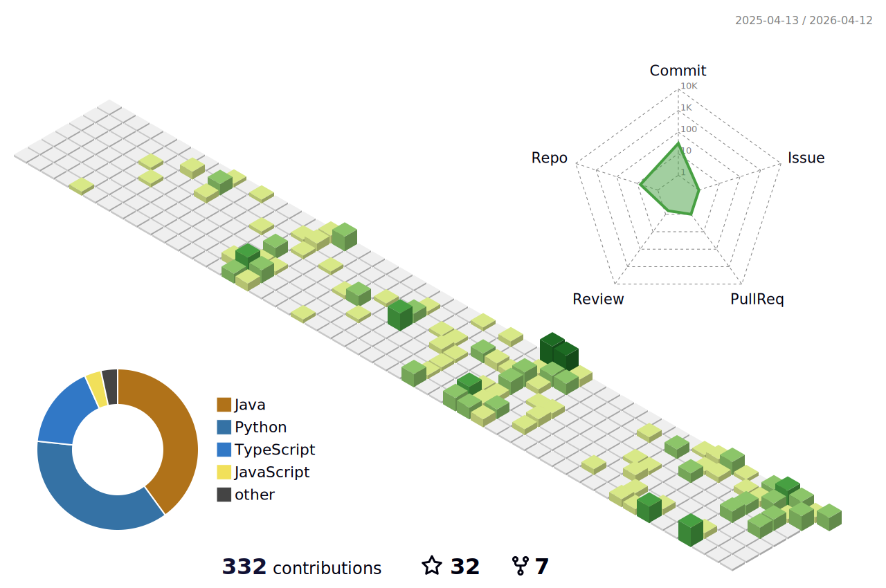

<h1 align="center">Hi. I am Rane Gillian Villanueva.</h1>

<h3 align="center">I am a BS Computer Engineer graduate with specialization in Cybersecurity at Mapúa University. I am interested in the fields of Web2 & Web3 Development, Cybersecurity, Mobile Development, Data Analysis and Visualization, and Artificial Intelligence. I have also created several projects. Check out the portfolio tab or visit my GitHub for more information about these projects.</h3>

      

---

## Links

      
      
      
          
          
      

---

## Profile Statistics

          

          
          

          
          
       

